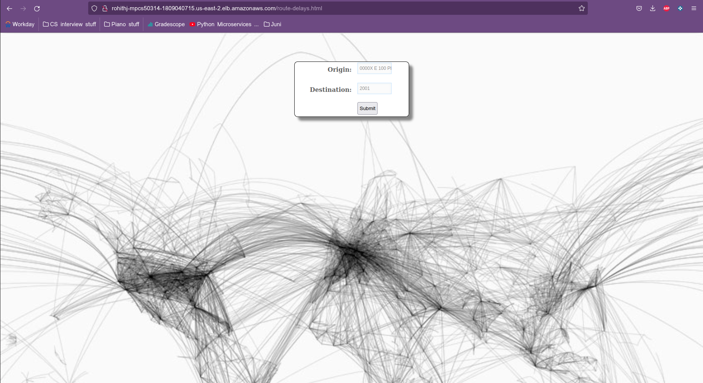
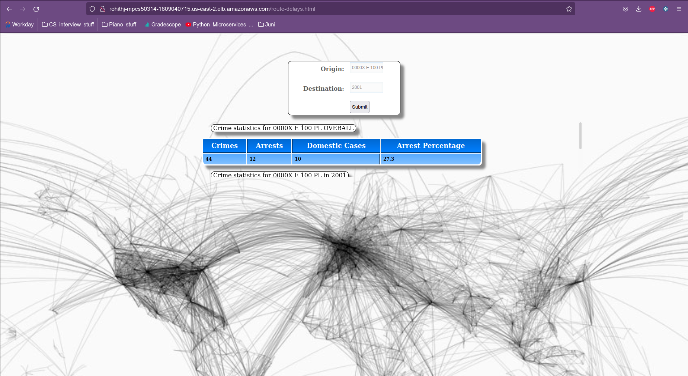

## Chicago Crime Statistics

http://rohithj-mpcs50314-1809040715.us-east-2.elb.amazonaws.com/route-delays.html

This project is an application of the Lambda Architecture that tracks the recorded crimes in chicago and analyses the number of crimes that ended with an arrest. It shows the total number of crimes for a block (or street), total arrests, crimes that were domestic in nature and arrest percentage. It also shows the same statistics for a particular chosen year.

It was completed as the final project for MPCS53014 - Big Data Application Architecture at the University of Chicago.

## Data

The dataset was taken from the City of Chicago's open data portal:

- [Crime data from 2001-2021](https://data.cityofchicago.org/Public-Safety/Crimes-2001-to-Present/ijzp-q8t2/data) shows each crime along with a myriad of other data for every beat in the city.

The dataset was exported in csv and bulk downloaded (using the script 1.getData.sh in the batch_layer folder), and the size was about 1.6 GB.

## Structure

The project implements two out of the three layers of the Lambda Architecture:
- Batch layer - manages the master dataset (the source of truth), which is an immutable, append-only set of raw data. It pre-computes batch views
from the master dataset.
- Serving layer - responds to ad-hoc queries by returning pre-computed views (from the batch layer) or building views from the processed data.
- Speed layer - deals with up-to-date data only to compensate for the high latency of the batch layer (not present)

It also uses a front-end web app to convert output to a graphical interface.

#### Batch Layer

The batch layer stores the master datasets `rohithj_crimes_csv` and `rohithj_crimes` in HDFS hosted in Amazon Web Services. 
It ingests the raw historical data through bash scripts and creates Hive tables containg the raw csv data. These are then copied 
and stored in ORC file format.

#### Serving Layer

The serving layer takes the ORC tables in Hive, which were created in the batch layer, and stores them in HBase. These views
are pre-computed and called through ad-hoc queries that are requested from the web app.
The Hbase tables used in the webapp are `rohithj_total` and `rohithj_yearly`.

#### Web App

The Node.js web application allows users to search for a street (eg. S BLACKSTONE AVE) and a year. It then displays the total crime statistics for the street since 2001 and also for the specific year chosen. 
The app has been deployed ont he load balanced servers, and can be accessed using the link at the very top.

If the format of the street isn't exactly as it is in the dataset, you will receive no results. 
If one wants to be more specific, they can search for a block (057XX S BLACKSTONE AVE). Again, this is subject to the block perfectly matching with the entry in the table. The block needs to be in all caps to work.

#### List of example street names for reference

N EDENS PKWY                   

N ELBRIDGE AVE                 

S BLACKSTONE AVE

S DREXEL AVE

E 100 PL

If the street/block you're searching for does not give any results, it would be helpful to search for the name in [the original dataset](https://data.cityofchicago.org/Public-Safety/Crimes-2001-to-Present/ijzp-q8t2/data) and use the same format.